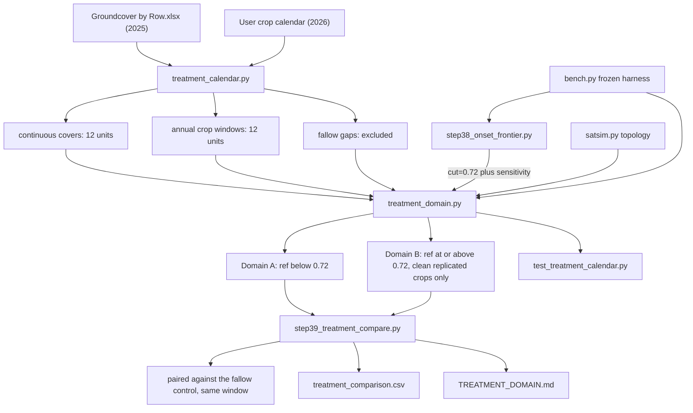

# Treatment Comparison Under Saturation Masking — Plan

**Status:** agreed, not yet implemented — three calendar items await confirmation (§8)
**Goal:** remove observations potentially subject to MPPT saturation before comparing
productivity across crop treatments, under a broad range of operating conditions.
**Depends on:** the frozen `vat-v1` saturation work (`sat_work/research/bench.py`,
`satsim.py`, `canon_metrics.py`), the 2025 treatment map in
`data/raw/Groundcover by Row.xlsx`, and the crop calendar supplied by the user (2026-09-25).

---

## 1. Decisions locked

| # | Decision | Choice |
|---|---|---|
| 1 | Domain strategy | **Two-domain.** Domain A = common unbiased comparison across all treatments. Domain B = high irradiance, restricted to treatments with uncontaminated replication, presented as a *restricted analysis only*. |
| 2 | Cutoff | **`ref = 0.72`**, described as an *operational, conservative* cutoff supported by the observed onset region — not as exact physical onset at 0.72. Sensitivity check at **0.70 / 0.72 / 0.75**. |
| 3 | Primary metric | **Irradiance-normalized performance.** Cumulative kWh reported **secondarily**, for physical interpretation. |
| 4 | Treatment variable | **A per-unit crop calendar**, not calendar seasons. Each crop has its own planting and harvest window, so a treatment is identified by `(crop, window, units)` and is analysed over its own window only. |
| 5 | Fallow periods | **Excluded.** Periods on an annual-crop unit between removal and the next planting carry no crop and are not part of any treatment. |
| 6 | Primary contrast | **Treatment versus the fallow control, paired in time over the treatment's own window** (§5.2). The control is continuous, so this removes weather and season from the comparison. |
| 7 | `Strawberry and Cabbage` (EU-01, n = 1) | **Descriptive only.** Retained in tables for completeness; no interval, no pairwise test, excluded from Domain B. |

---

## 2. The treatment calendar

The central artefact of this revision. A treatment is a `(crop, units, start, end)` interval;
the assignment for a unit at a timestamp is whatever interval contains it, or `fallow`, or
`unassigned`.

### 2.1 Continuous covers — 12 units, whole record

These treatments have no planting date and their unit blocks are **identical in the 2025
workbook and the 2026 map**, so they are assigned for the entire record and need no season
boundary at all.

| Treatment | Units | n | On a shared MPPT | Status |
|---|---|---|---|---|
| Fallow control | EU-05, EU-15, EU-17 | 3 | — | **confirmed** by user |
| Polli mix-1 | EU-04, EU-12, EU-23 | 3 | — | continuous — **to confirm** |
| Polli mix-2 | EU-07, EU-13, EU-21 | 3 | **yes** — eu_13, eu_21, plus faulty eu_7 | continuous — **to confirm** |
| Raspberry | EU-08, EU-16, EU-20 | 3 | **yes** — eu_08, eu_16 | continuous — **to confirm** |

The control is unplanted ground. The user describes it as fallow/bare soil, and the workbook
measures 78.9 % vegetation / 20.5 % soil on those units — consistent if that vegetation is
volunteer growth on fallow ground, which is expected by mid-summer across the May–Oct
sampling dates. The two readings are reconciled, but the wording of the control needs
confirming (§8).

Note that all four covers measure 79–83 % vegetation with **no plastic and no mulch**,
whereas every annual crop carries plastic and/or mulch. The cover composition corroborates
the split between continuous covers and annual crops.

### 2.2 Annual crops — 12 units, per-unit windows

| Crop | Units | Window | n | Shared |
|---|---|---|---|---|
| Broccoli | EU-02, EU-09, EU-22 | planted 2025-04-17, removed 2025-07-10 | 3 | — |
| Summer Squash | EU-06, EU-10, EU-18 | planted 2025-05-29, removed 2025-09-05 | 3 | **yes** — eu_10, eu_18 |
| Bell Peppers | EU-03, EU-14, EU-19 | planted 2025-06-10, removed 2025-11-06 | 3 | — |
| Strawberry (2025) | EU-01, EU-11, EU-24 | from 2025-05-01 to ~2026-04 (early April) | 3 | — |
| Strawberry (2026) | EU-01 | ~2026-04 to 2026-08-07 | **1** | — |
| Cabbage (2026) | EU-01 | transplanted 2026-08-07 to record end | **1** | — |
| Lettuce and Cabbage (2026) | EU-11, EU-24 | transplanted 2026-05-14; lettuce harvested 2026-07-02, cabbage 2026-07-21 | **2** | — |
| Lettuce and Cabbage, 2nd planting | EU-11, EU-24 | transplanted 2026-08-03 to record end | **2** | — |
| Tomato (2026) | EU-02, EU-09, EU-22 | planted 2026-05-21, still harvesting at record end | 3 | — |
| Watermelon (2026) | EU-03, EU-14, EU-19 | planted 2026-06-01, still harvesting at record end | 3 | — |
| Sweet Potato (2026) | EU-06, EU-10, EU-18 | planted 2026-06-04, not harvested | 3 | **yes** — eu_10, eu_18 |

Harvest dates are recorded in the calendar for phenology but do **not** truncate the analysis
window, which runs from planting to removal or record end. This keeps the window definition a
single rule.

Three crops are still in the ground when the record ends on 2026-08-31 (tomato, watermelon,
sweet potato), and sweet potato is never harvested. Their windows are truncated by the record,
not by the crop, so their performance figures describe a partial season (§7).

### 2.3 Fallow gaps — excluded

Every annual-crop unit has a long unplanted period between removal and the next planting:

| Units | Gap | Span |
|---|---|---|
| EU-02, EU-09, EU-22 | after broccoli removal → tomato planting | 2025-07-10 → 2026-05-21 |
| EU-03, EU-14, EU-19 | after pepper removal → watermelon planting | 2025-11-06 → 2026-06-01 |
| EU-06, EU-10, EU-18 | after squash removal → sweet potato planting | 2025-09-05 → 2026-06-04 |
| EU-11, EU-24 | between cabbage harvest and 2nd planting | 2026-07-21 → 2026-08-03 |

These are fallow/bare and carry no treatment. They are excluded from every comparison, per
decision 5. They are retained as an explicit `fallow` label rather than silently dropped, so
the exclusion is auditable.

### 2.4 Coverage

Domain: unit active, `ref >= 0.30`.

| Assignment state | Unit-observations | Share |
|---|---|---|
| assigned | 710,398 of 868,099 | **81.8 %** |
| unassigned (annual fallow gaps) | 157,701 | 18.2 % |
| — of which retained after the 0.72 cut | 381,526 | 53.7 % of assigned |

Before the calendar, only 31.8 % of unit-observations had an assignable treatment; the
continuous-cover assumption accounts for the difference.

### 2.5 Provenance

- **2025 map:** `data/raw/Groundcover by Row.xlsx`, AREA 1 — six sampling dates, May 21 to
  Oct 16 2025. Corroborated by `data/microclimate_summary.csv` (17 units) and by the earlier
  planning document `~/.cursor/plans/agrivoltaic_crop_power_analysis_587a0bc2.plan.md`.
- **2026 map and all crop dates:** supplied by the user 2026-09-25. There is **no 2026
  ground-cover data in the repo** — the workbook is 2025-only — so this has no independent
  in-repo corroboration and must be recorded as externally supplied.

---

## 3. Saturation nesting, and the affected/clean split

The shared-MPPT blocks are `{eu_8, eu_16}`, `{eu_10, eu_18}`, `{eu_13, eu_21}`, and `eu_7` is
the confirmed-faulty unit.

| Crop | Units on a shared channel | Clean units |
|---|---|---|
| Raspberry | eu_08, eu_16 | 1 (eu_20) |
| Summer Squash / Sweet Potato | eu_10, eu_18 | 1 (eu_06) |
| Polli mix-2 | eu_13, eu_21, plus faulty eu_07 | **0** |
| everything else | — | all |

`AFFECTED` (contains a shared channel): **Raspberry, Summer Squash / Sweet Potato, Polli
mix-2**. `CLEAN`: the other six crops.

**Saturation is nested inside treatments.** Each shared channel carries two units of the same
crop, so an unfiltered comparison systematically penalizes exactly those three crops. Polli
mix-2 has no clean unit at all. Equally, the affected crops have at most **one** clean unit,
so their treatment means necessarily rest on shared units — acceptable in Domain A, where the
shared units are unbiased, but it means they can never enter Domain B.

Because Polli mix-2 and Raspberry are continuous covers while Summer Squash / Sweet Potato is
annual, the affected set is stable year to year only in its *unit blocks*, not in its crop
names. All reporting is therefore by `(crop, window)`.

---

## 4. Why a row mask is not enough, and what the cut costs

The shipped detector recovers only ~35 % of clipped samples at ~99 % precision
(`METHODS_RESULTS.md` §2.5). Masking only flagged rows therefore leaks: at `ref 0.80-0.85`
only 34-55 % of shared-pair rows are flagged, yet the unflagged rows still carry a median
deficit of 0.14-0.17, at or above the 0.15 decision threshold.

### 4.1 Onset, per shared-MPPT pair

Peer ratio against the cross-inverter control `eu_1+eu_3` (1.000 = unclipped), and the
detector's own median deficit. Computed on the whole record, since onset is a property of the
hardware rather than of a crop.

| `ref` bin | `eu_8+eu_16` | `eu_10+eu_18` | `eu_13+eu_21` |
|---|---|---|---|
| 0.60-0.65 | 0.992 / +0.007 | 0.994 / +0.005 | 0.986 / +0.006 |
| 0.68-0.71 | 0.986 / +0.012 | 0.989 / +0.010 | 0.978 / +0.014 |
| 0.71-0.75 | 0.979 / +0.023 | 0.984 / +0.017 | 0.980 / +0.016 |
| 0.75-0.79 | **0.932** / +0.076 | **0.934** / +0.071 | **0.948** / +0.053 |
| 0.79-0.82 | 0.879 / +0.131 | 0.881 / +0.127 | 0.894 / +0.110 |
| 0.82-0.86 | 0.816 / +0.194 | 0.824 / +0.186 | 0.834 / +0.171 |
| 0.86-0.90 | 0.766 / +0.243 | 0.772 / +0.236 | 0.781 / +0.224 |
| 0.90-1.05 | 0.62-0.66 / +0.29..+0.43 | 0.59-0.67 / +0.29..+0.43 | 0.63-0.69 / +0.27..+0.37 |

- Clipping is invisible below `ref ~ 0.72` (median deficit <= 0.015, peer ratio >= 0.978).
  The detector's gate `REF_ON = 0.70` sits *below* the observed onset, so it is conservative.
- The three pairs share one onset (within ~0.02 at every bin), so one common threshold is
  justified — there is no pair-specific onset to exploit.
- The 0.15 decision threshold only bites at `ref ~ 0.80-0.85`, not at 0.72.

**Wording rule:** the onset *region* is 0.72-0.80; 0.72 is the conservative edge of it.

### 4.2 Cost of a common cut

| keep `ref < c` | rows kept | **energy kept** | worst top-bin median deficit |
|---|---|---|---|
| 0.70 | 51.9 % | **41.2 %** | +0.014 |
| **0.72** | **54.9 %** | **44.4 %** | **+0.015** |
| 0.75 | 60.0 % | 50.2 % | +0.026 |
| 0.78 | 66.3 % | 57.6 % | +0.068 |
| 0.80 | 71.6 % | 64.0 % | +0.104 |
| no mask | 100 % | 100 % | +0.37 |

The loss is **flat across the solar day** (at c = 0.75: 09:00 46 %, 12:00 43 %, 16:00 50 %),
so it is not a noon-trim. It is **seasonal**: April-August loses 45-56 %, Nov-Jan nothing.
It is **treatment-neutral** (37-43 %, a 6 pp spread), which is what a mask must be.

### 4.3 What can be retained at high irradiance

| population, `ref >= 0.80` | retained validly? | evidence |
|---|---|---|
| 17 independent units (in the clean crops) | **Yes, all of it** | control pairs median +0.004..+0.008, share `d > 0.15` = 0.02-1.5 % |
| 6 shared units, `ref >= 0.80` | **No** | 0-6 % of rows have `d <= 0.02`; median already 0.14-0.17 |
| 6 shared units, `ref >= 0.85` | **No** | 88-90 % flagged, median 0.21-0.31, <=1.4 % clean |
| 6 shared units, `ref 0.72-0.80` | **Partially** | shoulder: median 0.02-0.07; ~5-14 % clean at 0.75-0.78 |

**The mask's cost falls on 24 units while the contamination exists in only 6.** That is why
Domain B can exist.

### 4.4 Bias being removed

Saturation costs **8.6 %, 9.4 %, 9.4 %** of each affected pair's total output
(2,871 / 3,699 / 2,680 kWh). Left unfiltered it depresses exactly the three affected crops.

---

## 5. Design



### 5.1 The two domains

- **Domain A** = `unit active ∧ ref < 0.72 ∧ no DQ flag ∧ crop assigned`. All crops, each over
  its own window. The unbiased comparison domain.
- **Domain B** = `unit active ∧ ref >= 0.72 ∧ no DQ flag ∧ crop assigned`, restricted to the
  clean crops that also have replication. A restricted analysis only; carries no comparison
  against the affected crops.

Domain B is defensible because the natural experiment in `SATURATION_REVIEW.md` §3.12 shows
the inverter mates of the clipped pairs are flat at ~0 %: the clean crops' units are genuinely
uncontaminated.

The masking rule is a function of `ref`, activity and DQ **only** — never of unit or crop
identity — so it cannot introduce a treatment-correlated selection effect.

### 5.2 The primary contrast: paired against the fallow control

Crop windows differ in length and calendar position, so comparing raw per-crop levels would
confound the crop with the weather it happened to experience. The fallow control is
continuous and unplanted, so it experiences the same weather. For each crop `T` with window
`W`:

```python
perf(crop, W) = sum_{t in W, domain} P(t) / sum_{t in W, domain} ref(t)
relative_T    = perf(T, W_T) / perf(control, W_T)          # control over the SAME window
```

`perf` is the `theta` construction restricted to the domain, so it inherits the existing
9.0 kW nameplate cross-check, and it is a slope in W per ref-unit — a rate, therefore
comparable across windows of unequal length. Because `ref` cancels in the ratio, `relative_T`
is dimensionless.

Reported three ways:

- `relative_T` versus the control — the primary, weather-controlled contrast;
- the absolute `perf` in physical units `W per kW/m^2`, via `1 ref-unit = 1,159 W/m^2`
  (`irradiance_proxy_vs_sensor.ipynb` §9);
- cumulative kWh per unit, `sum_t P_u(t)`, for physical interpretation only — explicitly not
  comparable across unequal windows.

**Uncertainty** — day-blocked bootstrap (resample days, not rows, to respect autocorrelation),
95 % intervals on each crop's `relative_T` and on pairwise differences. New: the repo
currently has no uncertainty estimates.

---

## 6. Deliverables

### 6.1 `sat_work/research/treatment_calendar.py` (new)

- `CROP_INTERVALS` — every interval from §2, as `(crop, units, start, end, season)`.
- `CONTINUOUS` — the four covers of §2.1.
- `FALLOW_GAP` — the gaps of §2.3, labelled rather than dropped.
- `assignment(timestamp) -> {(unit, crop | 'fallow' | 'unassigned')}`.
- `AFFECTED` / `CLEAN`, derived from `satsim.SHARED` rather than hard-coded, with assertions
  in **both** crop seasons that every shared unit sits inside an affected crop and no clean
  crop's unit is shared.
- `SINGLE_UNIT = ("Strawberry and Cabbage",)` — descriptive-only.
- `DOMAIN_A_CUT = 0.72`, `SENSITIVITY = (0.70, 0.72, 0.75)`.
- A loader that re-reads the workbook and asserts the 2025 map reproduces the literal dict, so
  it cannot silently drift. The 2026 map and all dates have no in-repo source and are marked
  externally supplied.

### 6.2 `sat_work/research/step38_onset_frontier.py` (new)

Reuses `bench.pair_deficit` and `bench.det_rolling` — no threshold is re-declared anywhere.

- Onset table of §4.1 and frontier of §4.2, computed on the whole record.
- Retention by hour of day, by month, and per crop per window.
- Writes `sat_work/research/_out_step38_onset_frontier.txt` and `treatment_domain.png`.
- Locks the observed onset bin as a regression constant.

### 6.3 `sat_work/research/treatment_domain.py` (new)

- `domain_flags(df, fe, cut) -> DataFrame` — per `(timestamp, unit)`: `retained` plus a reason
  code (`kept`, `saturation_risk`, `dq_flag`, `unit_inactive`, `fallow`, `crop_unassigned`).
- `retained_summary(cut)` — rows / hours / kWh retained per crop per window, so the cost is
  visible per crop rather than pooled.
- `domain_a(crop)` / `domain_b(crop)`.
- Exports `treatment_domain.csv` (base name, consistent with the repo's gitignored `*.csv`
  convention).
- Does **not** touch `saturation_flags.csv` or `sat_work/canonical/`.

### 6.4 `sat_work/research/step39_treatment_compare.py` (new)

Every result is computed **within one crop window**. No cross-season or cross-window pooling.

- `relative_T` versus the control (§5.2), plus absolute `perf` and cumulative kWh.
- Day-blocked bootstrap intervals; the control is the reference.
- `treatment_comparison.csv` — per `(crop, season, domain)`: metric, kWh, n units, retained
  rows/hours/kWh, interval.
- Domain A across all crops, mask-on beside mask-off, so the bias removed is quantified
  rather than asserted.
- Domain B for the clean replicated crops only, labelled a restricted high-irradiance
  analysis.
- EU-01 rows marked `descriptive_only`, with no interval and no pairwise test.
- Cut sensitivity: everything recomputed at 0.70 / 0.72 / 0.75; the key claim is that the crop
  **ordering** is stable across all three.

### 6.5 `sat_work/tests/test_treatment_calendar.py` (new)

Registered in `TEST_MODULES` at `sat_work/tests/run_tests.py`.

- The 2025 map matches the workbook exactly (8 treatments, 3 units each, `eu_7` excluded).
- The 2026 map covers all 24 units exactly once, with the declared replication profile.
- Continuous covers are assigned at every timestamp; annual crops are assigned only inside
  their windows.
- **Calendar partition is exclusive:** no unit-timestamp is assigned to two crops, and every
  gap is labelled `fallow`, not silently absent.
- The shared/clean decomposition matches `satsim.SHARED` in **both** crop seasons.
- **Mask invariance:** at a timestamp where all units are active and unflagged, `retained`
  depends only on `ref` — the same value for every unit.
- No retained row has `ref >= cut`.
- The clean crops retain 100 % of their `ref >= 0.80` rows; Domain B contains none of the six
  shared units and not EU-01.
- Onset-bin regression lock from 6.2.

### 6.6 `TREATMENT_DOMAIN.md` (new)

Findings on their own terms, with one figure (onset curves, frontier, per-crop retention) and
the caveats stated explicitly. Reports each crop window separately, ordered by season.

---

## 7. Caveats the write-up must carry

1. **The cut is operational, not a measured physical onset.** Onset region is 0.72-0.80;
   0.72 is the conservative edge.
2. **Domain B cannot support an all-crop comparison.** Three crops are absent by construction,
   and non-randomly.
3. **Crop windows differ in length and position** and must never be pooled. The paired
   control contrast (§5.2) is what makes them comparable; a raw per-crop level is not a valid
   cross-crop statement.
4. **Three crops are truncated by the record end.** Tomato, watermelon and sweet potato were
   still in the ground on 2026-08-31, and sweet potato is never harvested. Their figures
   describe a partial season and are not comparable to a completed cycle.
5. **The affected crops have at most one clean unit, and Polli mix-2 has none.** Their means
   rest on shared units in Domain A, which is unbiased below 0.72, but they can never enter
   Domain B.
6. **`ref` is built from units under study.** A common time-varying scaling cancels in a
   between-crop comparison, but if crops differ in *shape* vs irradiance (temperature
   coefficient, soiling), the median-over-11 proxy could carry a second-order pull toward
   majority crops. Mitigation: a POA-based repeat of the primary metric using
   `irradiance_may2025_aug_2026_area1.csv` as a robustness row — a check, not the primary
   normalizer, because the join needs explicit `MM-DD-YYYY` parsing and the sensor-cleaning
   logic from the notebook.
7. **Uneven replication.** `Strawberry and Cabbage` (EU-01, n = 1) cannot yield a variance
   estimate, an interval, or a pairwise test. `Lettuce and Cabbage` (n = 2) carries wide
   intervals and should be treated as weak.
8. **The control is unplanted, not a crop.** A fallow reference measures the crop effect
   against no crop; it does not control for soil-cover differences (plastic, mulch) that
   distinguish the annual crops from each other.
9. **The 2026 map and all crop dates are externally supplied** and have no in-repo
   corroboration, unlike the 2025 map. An error propagates directly into the results.
10. **Boundary dates are a judgement, not a measurement.** No power or irradiance signal
    reveals planting or removal. Results should be shown to be insensitive to a reasonable
    shift in the window edges.
11. **Interval method.** The day-blocked bootstrap assumes day-level exchangeability; it is the
    honest minimum, not a full time-series treatment.

---

## 8. Open items

| # | Item | Blocks |
|---|---|---|
| 1 | **Confirm the wording of the control.** User states fallow/bare soil; the workbook measures 79 % vegetation on EU-05/15/17. Interpreted as volunteer growth on fallow ground — needs confirming, since it sets how the control is described. | the control's definition in the write-up |
| 2 | **Confirm Polli mix-1, Polli mix-2 and Raspberry are continuous** for the whole record. User to confirm later. | 9 of the 24 units; 81.8 % coverage assumes yes |
| 3 | **Pin the 2025 strawberry window end** — given as "early April 2026". | EU-01/11/24 window edge |
| 4 | Primary metric deflation | default: report both `relative_T` and absolute `W per kW/m^2` |
| 5 | POA robustness row | default: include |
| 6 | Bootstrap reference | default: the fallow control |

---

## 9. Out of scope

No edits to `sat_work/research/bench.py`, `satsim.py`, `canon_metrics.py`, the canonical
manifest, `saturation_flags.csv`, or any existing notebook. The prior May-2026 analysis
(`saturate.ipynb`, `combined_apr_sep_2025_area1_with_saturated.csv`) is treated as superseded
and will not be resurrected; both of its input files are absent from the repo.
